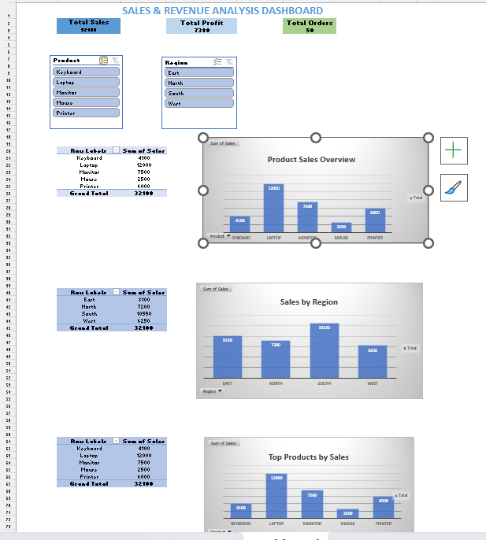

# Sales & Revenue Analysis Dashboard

## About the Project

This project was developed using Microsoft Excel to analyze sales and revenue data. The goal was to create a dashboard that provides a clear view of sales performance, product trends, and regional performance using charts and key performance indicators (KPIs).

## Dataset Information

The dataset contains the following fields:

* Order ID
* Date
* Product
* Region
* Quantity
* Sales
* Profit

A total of 50 sales records were used for analysis and visualization.

## Dashboard Preview

## Key Performance Indicators

* Total Sales: 32,100
* Total Profit: 7,380
* Total Orders: 50

## Dashboard Features

### 1. KPI Summary Cards

* Total Sales
* Total Profit
* Total Orders

### 2. Sales by Region

Displays sales performance across different regions and helps identify the highest-performing region.

### 3. Top Products by Sales

Highlights the products that generated the highest sales revenue.

### 4. Monthly Sales Trend

Shows how sales changed over time and helps identify trends.

## Tools Used

* Microsoft Excel
* Pivot Tables
* Pivot Charts
* Data Visualization

## Key Insights

* The South region recorded the highest sales.
* Laptops were the best-selling product category.
* The dashboard provides a quick overview of business performance through visual reports.

## Conclusion

This project demonstrates how Microsoft Excel can be used for data analysis and dashboard creation. By using Pivot Tables, charts, and KPI cards, raw sales data can be transformed into meaningful insights that support better decision-making.
